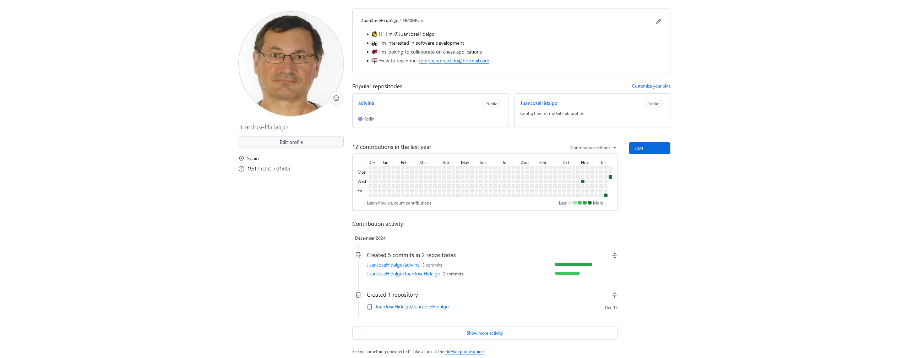
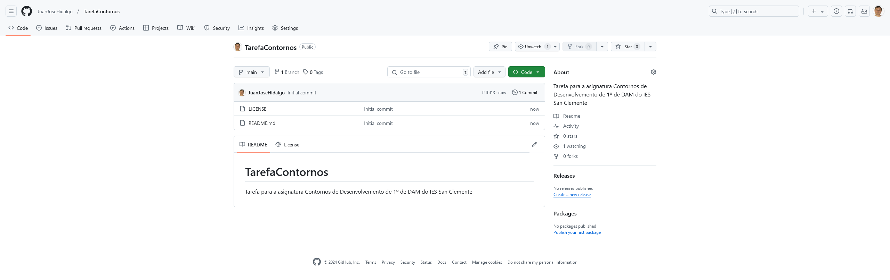
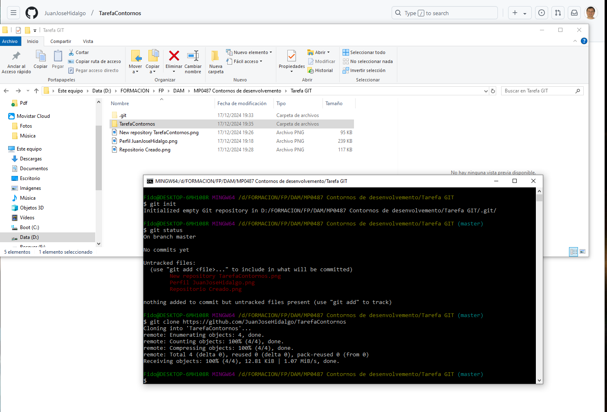
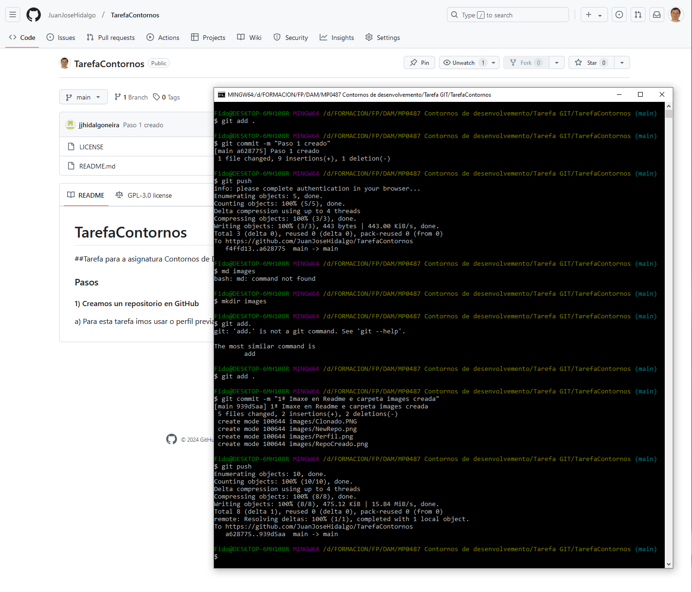

# TarefaContornos
## Tarefa para a asignatura Contornos de Desenvolvemento de 1º de DAM do IES San Clemente

### Pasos 

#### 1) Creamos un repositorio en GitHub

a) Para esta tarefa imos usar o perfil previamente creado usando a conta do IES San Clemente

b) No perfil creamos un novo repositorio 

c) Repositorio creado, aproveitando para crear o Readme.md de Paso

### 2) Clonamos o repositorio ao noso disco local, utilizando o GitBash
Unha vez creada a carpeta que imos utilizar para albergar o proxecto, nos situamos nela con GitBash
e executamos: 
#### git init
#### git clone https://github.com/JuanJoseHidalgo/TarefaContornos

Con esto quedan conectados a nosa carpeta local e o repositorio en GitHub

### 3) A partir de ahí uns breves comandos en GitBash e traballo rematado!!
